# examify Mobile App

Examify is a comprehensive Android exam processing mobile application developed using Flutter, Firebase, Stacked Architecture (MVVM), and Provider State Management. It is designed to streamline academic processes within higher education institutions, offering a range of features for different users.

## Key Features
### Support Team Management:
The support team is responsible for adding and managing all users within the system.

### Student Portal:
Students can log in and register for units each semester.
They can apply for special exams and track their academic performance and progress across different semesters.

### Lecturer Portal:
Lecturers can log in and input marks for students in assignments, CATs, and final exams.
They have access to detailed marksheets for each unit they handle.

### Chair of Department (COD) Portal:
CODs can log in and view student performance across all academic years within their specific course.
They can access consolidated marksheets, academic reports (Pass List, Fail List, Special Exams, Missing Marks), and the graduation list.

### Exam Coordinator Portal:
The exam coordinator can monitor overall student performance and review how lecturers have assigned marks.
Once all marks are entered by lecturers, the coordinator can approve and release official academic reports.

## Below are the Different Screens

## Authentication Screens of the app
- It is the work of the support team to Create the users (to add the users). And after  they are 
added they can now be sent the login credentials and be able to login.
### Support Team Dashboard
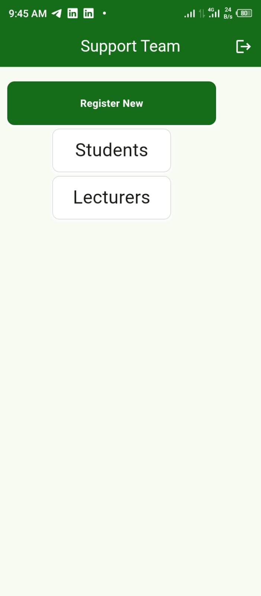
### Add USers
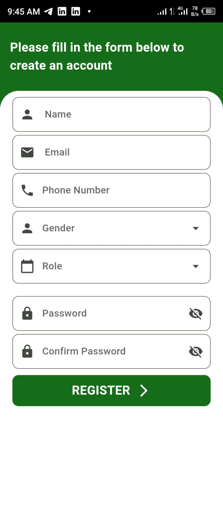
### Login 
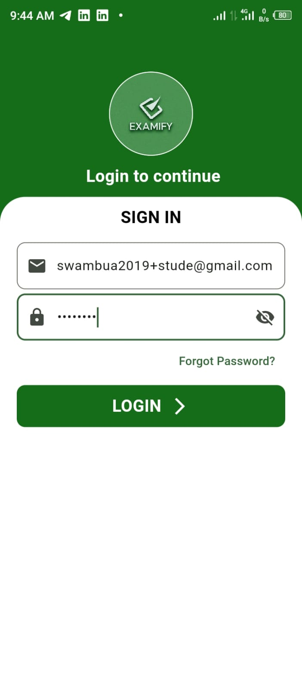
### Forgot Password
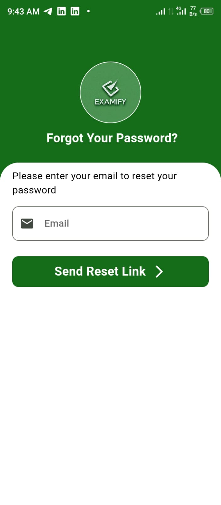
### All Students
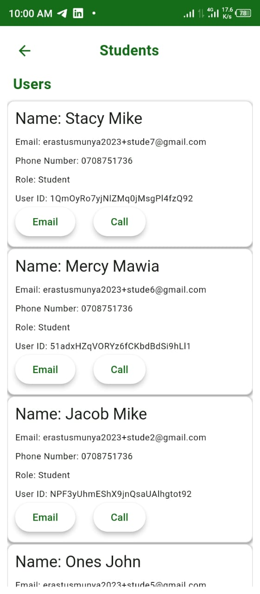
### All Lecturers
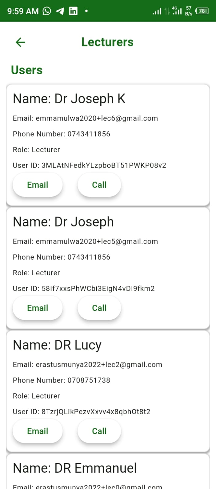
### profile

## Student Dashboard
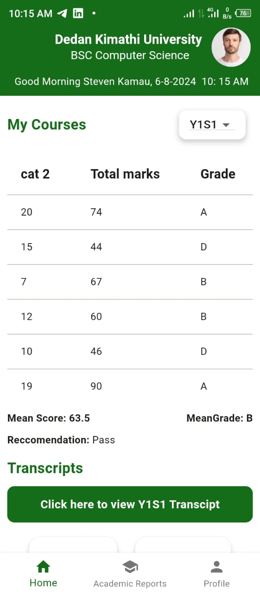

### Register Units

### units Waiting Approval
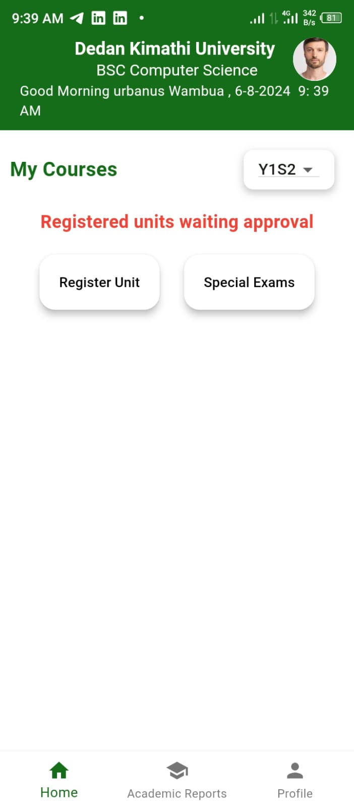
### Apply Special Exams
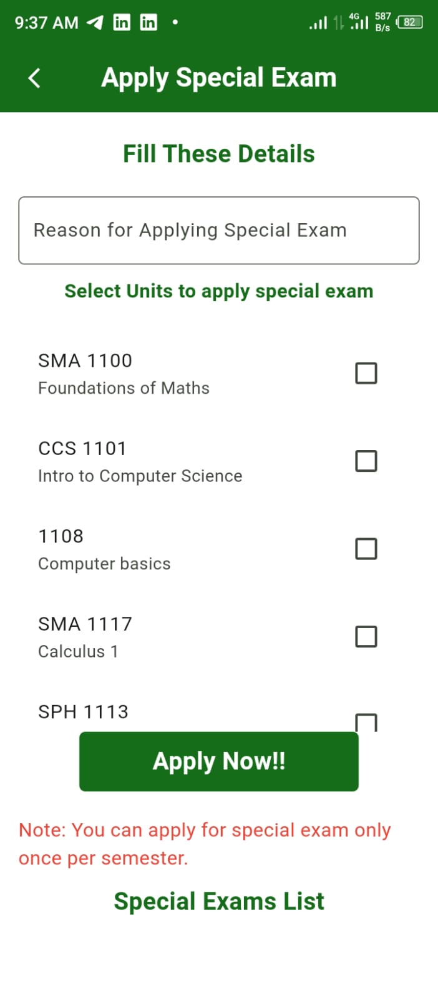
### Student Transcript for a specific semester
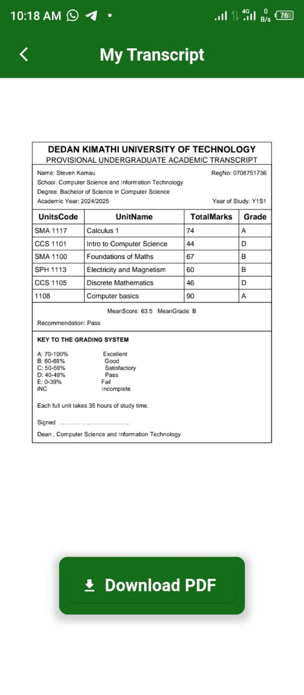

## Lecturer Dashboard
[text](Assets/Images/lecturer_dashboardjpeg)
### Customize Units 
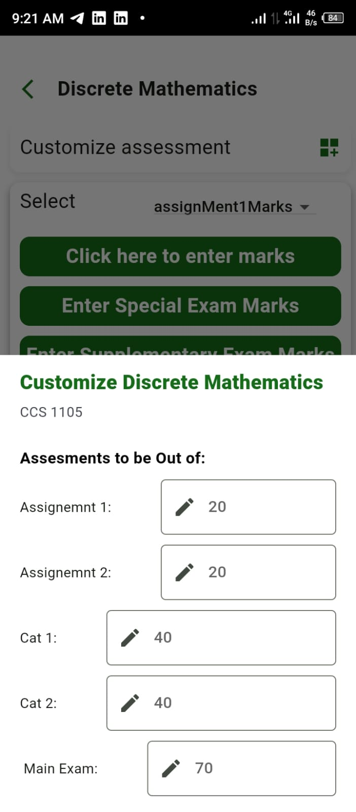
### Assign Marks
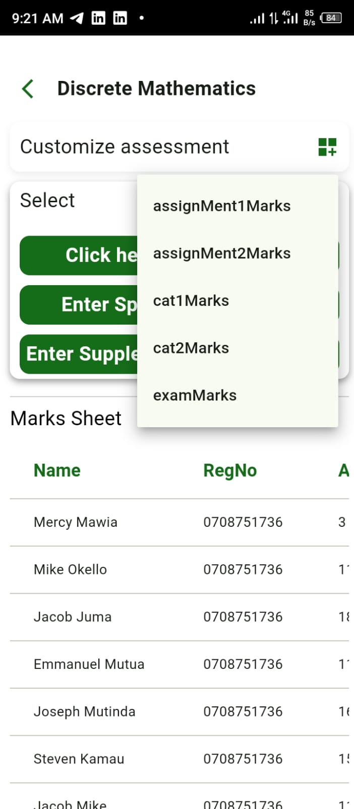
### Marks Sheet for a specific unit
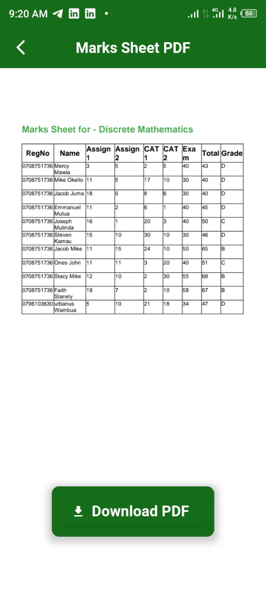

## COD Dashboard
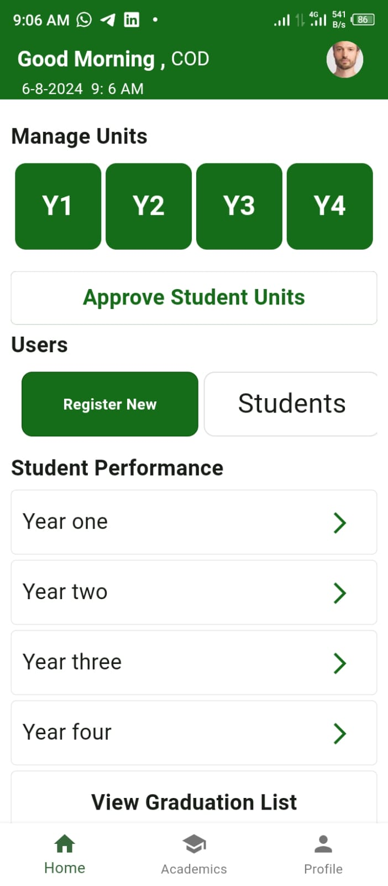
### View Students Performance

### View marks Sheets
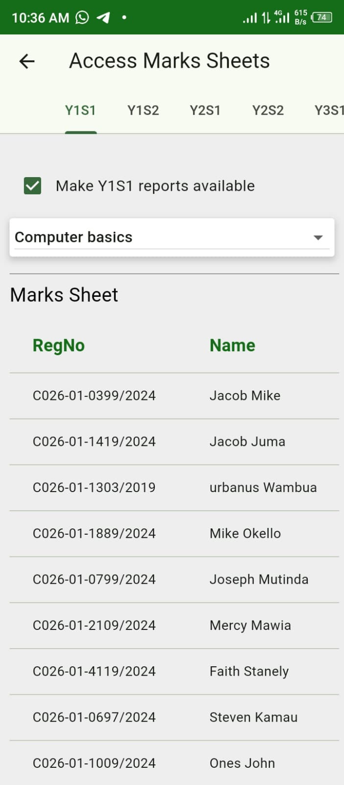

## Exam coordinator
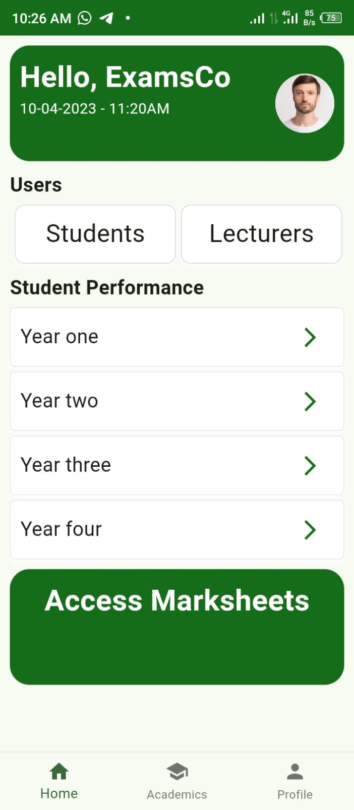
### View Academic Reports 
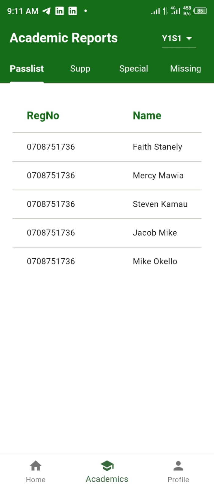
### View concolidated Marks Sheet
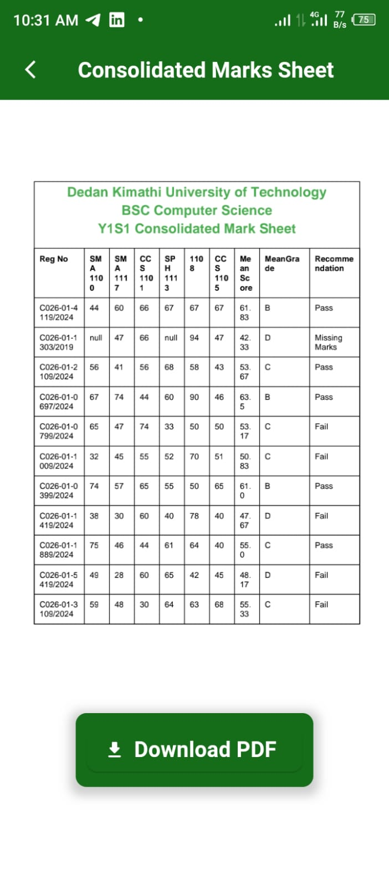
